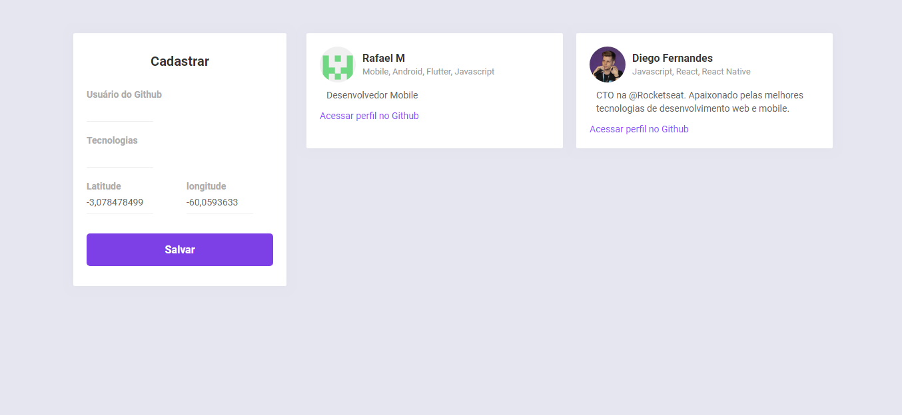
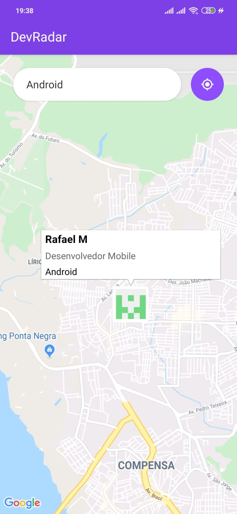

# DevRadar
> Lista e pasta do software desenvolvido em Javascript usando NodeJs, React, React-Native.

[![NPM Version][npm-image]][npm-url]
[![Build Status][travis-image]][travis-url]
[![Downloads Stats][npm-downloads]][npm-url]

## Back Nodejs

O node faz toda conexao entre a parte web adicionando os usuarios no banco e retornando tanto para visualizar na web quanto do mobile

## Web React

Adiciona o usuario usando apenas o nome do github quais tecnologias ele gosta e sua localizacao.

## Mobiel React-Native

Voce consegue visualizar através de um mapa os desenvolvedores perto com seu nome e localizacao ao clicar no icone tambem e possivel visualizar seu perfil no github.

## Como funciona

No WEB adicionar desenvolvedores através do github mais perto de voce usando um Mobile assim podendo ver o desenvolvedor que gosta da mesma tecnologias que vc mais proximo para bater um papo sobre as tecnologias e toda e a conexäo usada no back end foi NodeJs.

## Foi usado

* Mongodb
* React
* React-Native
* Nodejs
* Insomnia
* VsCode

## Omnistack 10.0
Foi desenvolvido o projeto em 1 semana na semana do Omnistack oferecido pela Rockeatseat feito comecado e terminado de segunda ate sexta

## Repositorios

Repositorio Back End em NodeJs
[Nodejs](https://github.com/RafaelMScience/BackEnd_DevRadar)

Repositorio Web em React
[React](https://github.com/RafaelMScience/Web_DevRadar)

Repositorio Mobile em React Native
[React-Native](https://github.com/RafaelMScience/Mobile_DevRada)

[npm-image]: https://img.shields.io/npm/v/datadog-metrics.svg?style=flat-square
[npm-url]: https://npmjs.org/package/datadog-metrics
[npm-downloads]: https://img.shields.io/npm/dm/datadog-metrics.svg?style=flat-square
[travis-image]: https://img.shields.io/travis/dbader/node-datadog-metrics/master.svg?style=flat-square
[travis-url]: https://travis-ci.org/dbader/node-datadog-metrics
[wiki]: https://github.com/seunome/seuprojeto/wiki
